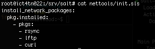

# Configuration Management Systems - ict4tn022-3010

Exercises in the course:  
[h1 hello master-slave](https://hanu.org/ict4tn022-3010/h1-hello-master-slave.html)  
[h2 package file-server](https://hanu.org/ict4tn022-3010/h2_package_file-server.html)  
[h3 version control](https://hanu.org/ict4tn022-3010/h3-versionhallinta.html)  
[h4 timeline](https://hanu.org/ict4tn022-3010/h4-timeline.html)  
[h5 new command](https://hanu.org/ict4tn022-3010/h5-new-command.html)  
[h6 moottorix](https://hanu.org/ict4tn022-3010/h6-moottorix.html)  
[h7 own module part 1](https://hanu.org/ict4tn022-3010/h7-my_module.html)  
[h7 own module part 2](https://hanu.org/ict4tn022-3010/h7-nagios.html) 

## h1 hello master-slave

### Exercise a) 
Install Salt and a new minion for it

The task was accomplished by installing two new virtual servers.
Ubuntu 18.04 was chosen as the operating system for the master and slave servers.
(Xubuntu on the master server and server version on the slave server).

**salt master: ict4tn022** 


installed packages:

```
salt-common 2017.7.4+dfsg1-1ubuntu18.04.2
salt-master 2017.7.4+dfsg1-1ubuntu18.04.2
```

**salt slave: ict4n022-slave**


Installed packages:

```
salt-common 2017.7.4+dfsg1-1ubuntu18.04.2
salt-minion 2017.7.4+dfsg1-1ubuntu18.04.2 
```

### Exercise b) 
Create a new idempotent Hei maailma.

```
hanu@ict4tn022:/srv/salt$ ls -al hello/
total 16
drwxr-xr-x 2 root root 4096 Oct 29 04:34 . 
drwxr-xr-x 4 root root 4096 Oct 29 04:47 .. 
-rw-r--r-- 1 root root 36 Oct 29 04:34 hellosalt.txt 
-rw-r--r-- 1 root root 77 Oct 29 04:30 init.sls 
```


```
hanu@ict4tn022:/srv/salt$ cat hello/init.sls
/tmp/hellosalt.txt:
  file.managed:
    - source: salt://hello/hellosalt.txt 

```

```
hanu@ict4tn022:/srv/salt$ cat hello/hellosalt.txt 

Hei maailma
Toinen rivi
Kolmas rivi 
```

## Exercise c) 
Collect information from the server using Salt (grain.items)

```
sudo salt '*' grains.items|less
sudo salt '*' grains.items
sudo salt '*' grains.item virtual
sudo salt '*' grains.items | grep -i -C 3 amd64
```

### Exercise d) 
Try another state than file.managed.

`hanu@ict4tn022:~$ sudo salt '*' pkg.install `


### Exercise e) Optional: Install Salt master into server accessible to the internet


```
nc -v -z 2001:14ba:CENCORED 4505 
Connection to 2001:14ba:CENCORED 4505 port [tcp/*] succeeded! 
```

Additional bonus task:

Create a net tools state:

```
hanu@ict4tn022:/srv/salt# cat nettools/init.sls
install_network_packages:
   pkg.installed:
    - pkgs:
      - rsync
      - lftp
      - curl

```





```
sudo salt -G 'os:Ubuntu' test.ping
salt '*' state.show_sls nettools
```

