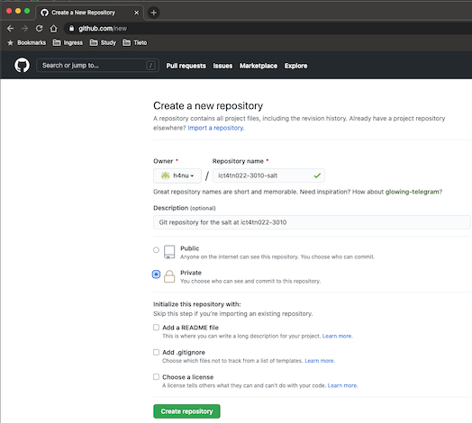

# Configuration Management Systems - ict4tn022-3010

Exercises in the course:  
[h1 hello master-slave](https://hanu.org/ict4tn022-3010/h1-hello-master-slave.html)  
[h2 package file-server](https://hanu.org/ict4tn022-3010/h2_package_file-server.html)  
[h3 version control](https://hanu.org/ict4tn022-3010/h3-versionhallinta.html)  
[h4 timeline](https://hanu.org/ict4tn022-3010/h4-timeline.html)  
[h5 new command](https://hanu.org/ict4tn022-3010/h5-new-command.html)  
[h6 moottorix](https://hanu.org/ict4tn022-3010/h6-moottorix.html)  
[h7 own module part 1](https://hanu.org/ict4tn022-3010/h7-my_module.html)  
[h7 own module part 2](https://hanu.org/ict4tn022-3010/h7-nagios.html)  

## h3 version control


### Exercise a) MarkDown. 

Report this exercise using MarkDown. (completed)
This document is stored in github and distributed with git to my web servers (aws & ovh).

Create a new repository for handling these exercises to github.



and create a new repository on the command line:

```
echo "# ict4tn022-3010-salt" >> README.md
git init
git add README.md
git add .
git commit -m "first commit"
git branch -M main
git remote add origin https://github.com/h4nu/ict4tn022-3010-salt.git
git push -u origin main

```


### Exercise b) 
Show examples of commands ‘git log’, ‘git diff’ ja ‘git blame’ in your own git repository . Explain the results.


The `git log` command shows the commit logs: 


```
commit 0f77f1aede06b231380078ce176863fb23ab5b1a (HEAD -> main, origin/main)
Author: root <root@ict4tn022.campus.hanu.org>
Date:   Thu Nov 12 00:43:43 2020 +0200

    first commit
```

Do some changes and check the changes between the commit and working tree with the command `git diff`


```
diff --git a/ssh/banner b/ssh/banner
index b197d04..689c14a 100644
--- a/ssh/banner
+++ b/ssh/banner
@@ -1,4 +1,4 @@
 # custom banner
-Welcome to foobar
+Welcome to slave 
 # custom banner
 #

```
The file `/srv/salt/ssh/banner` was changed:
The welcome message was changed from `Welcome to foobar` to `Welcome to slave`

git command to show the change and status 
`git blame ssh/banner`

```
^0f77f1a (root              2020-11-12 00:43:43 +0200 1) # custom banner
00000000 (Not Committed Yet 2020-11-12 00:56:12 +0200 2) Welcome to slave 
^0f77f1a (root              2020-11-12 00:43:43 +0200 3) # custom banner
^0f77f1a (root              2020-11-12 00:43:43 +0200 4) #
```

### Exercise c) 
Do an unwanted change to a repository. Undo the changes with `git reset --hard` command:


`HEAD is now at 0f77f1a first commit`

Check the changed file with `cat ssh/banner` command:

```
# custom banner
Welcome to foobar
# custom banner
#
```
The change was rolled back and the `git status` command reports that branch is up to date:
```
On branch main
Your branch is up to date with 'origin/main'.

nothing to commit, working tree clean
```

- - - 

### Exercise d) 
Create a new salt-module.

Disclaimer: I've been working as an architect for too long time and have not been able to get my hands dirty with real server management activities and as such, snmp details has long been forgotten... So, do not use any of the information below in online systems... 

I chose snmpd daemon as a new module because (imho) some monitoring component should be installed on the servers before installing the actual services the server is providing.


Slave:

Install and configure the snmpd manually and run tests.
`sudo apt install snmpd`

Modify the /etc/snmp/snmpd.conf file to match preferred configuration.
This time I mostly did snmpv3 related changes to the configuration file:

```
# createUser, securityName, authProtocol, authKey, privProtocol, privKey
createUser StdMonUsr  MD5 "change this one to smth else"
createUser BofhUsr SHA "remember to change this password too"  AES thisonetoo1234

# ro/rwuser, SecurityName, securityLevel
rouser   StdMonUsr authNoPriv
rwuser BofhUsr authPriv
```

test the system (SNMPv1) remotely
`snmpwalk -v 1 -c communityro 192.168.10.56 system`

```
SNMPv2-MIB::sysDescr.0 = STRING: Linux ict4n022-slave 4.15.0-123-generic #126-Ubuntu SMP Wed Oct 21 09:40:11 UTC 2020 x86_64
SNMPv2-MIB::sysObjectID.0 = OID: NET-SNMP-MIB::netSnmpAgentOIDs.10
DISMAN-EVENT-MIB::sysUpTimeInstance = Timeticks: (35003) 0:05:50.03
SNMPv2-MIB::sysContact.0 = STRING: John Doe <john@doe.org>
SNMPv2-MIB::sysName.0 = STRING: ict4n022-slave
SNMPv2-MIB::sysLocation.0 = STRING: Borough/Helsinki/Finland
```

test the system (SNMPv3) remotely

`snmpwalk -v3 -u BofhUsr -l authPriv -a SHA -A 'remember to change this password too' -x AES -X thisonetoo1234 192.168.10.56 system`

```
SNMPv2-MIB::sysDescr.0 = STRING: Linux ict4n022-slave 4.15.0-123-generic #126-Ubuntu SMP Wed Oct 21 09:40:11 UTC 2020 x86_64
SNMPv2-MIB::sysObjectID.0 = OID: NET-SNMP-MIB::netSnmpAgentOIDs.10
DISMAN-EVENT-MIB::sysUpTimeInstance = Timeticks: (41180) 0:06:51.80
SNMPv2-MIB::sysContact.0 = STRING: John Doe <john@doe.org>
SNMPv2-MIB::sysName.0 = STRING: ict4n022-slave
SNMPv2-MIB::sysLocation.0 = STRING: Borough/Helsinki/Finland
```

Master:

Define the variables in the pillar...

mmkdir -p /srv/pillar/snmpd/
vi /srv/pillar/snmpd/init.sls

```
snmp_syslocation: 'Borough/Helsinki/Finland'
snmp_syscontact: 'John Doe <john@doe.org>'
snmp_rocommunity: communityro
snmp_management_station: 192.168.10.52
snmp_allowed_networks: 192.168.10.0/24
snmp_rouser: StdMonUsr
snmp_rouser_pass: 'change this one to smth else'
snmp_rouser_seclevel: authNoPriv
snmp_rwuser: BofhUsr
snmp_rwuser_pass: 'remember to change this password too'
snmp_rwuser_enc: thisonetoo1234
snmp_rwuser_seclevel: authPriv
```
Refresh the pillar:

`sudo salt '*' saltutil.refresh_pillar -v`


mkdir -p /srv/salt/snmp/files

vi /srv/salt/snmp/init.sls

```
# deploy the snmpd package
snmpd:
  pkg.installed

# set the daemon startup and reload parameters
snmpd Service:
  service.running:
    - name: snmpd
    - enable: True
    - reload: True
    - require:
      - pkg: snmpd
    - watch:
      - file: /etc/snmp/snmpd.conf

# distribute the snmpd.conf
/etc/snmp/snmpd.conf:
  file.managed:
    - source: salt://snmp/files/snmpd.conf
    - template: jinja
    - user: root
    - group: root
    - mode: 644
    - require:
      - pkg: snmpd
    - watch_in:
       - service: snmpd

# install the snmp tools to enable local clients
snmp:
  pkg.installed
```
create the snmpd.conf source file

`vi /srv/salt/snmp/files/snmpd.conf`

```
## AGENT BEHAVIOUR
agentAddress udp:161,udp6:161
## SNMPv3 AUTHENTICATION
createUser {{ pillar['snmp_rouser'] }} MD5 '{{ pillar['snmp_rouser_pass'] }}'
createUser {{ pillar['snmp_rwuser'] }} SHA '{{ pillar['snmp_rwuser_pass'] }}' AES {{ pillar['snmp_rwuser_enc'] }}
#
## ACCESS CONTROL
view   systemonly  included   .1.3.6.1.2.1.1
view   systemonly  included   .1.3.6.1.2.1.25.1
#
rocommunity public localhost  -V systemonly
rocommunity6 public localhost -V systemonly
#
rocommunity {{ pillar['snmp_rocommunity'] }} {{ pillar['snmp_allowed_networks'] }}
#
rouser {{ pillar['snmp_rouser'] }} {{ pillar['snmp_rouser_seclevel'] }}
rwuser {{ pillar['snmp_rwuser'] }} {{ pillar['snmp_rwuser_seclevel'] }}
#
sysLocation {{ pillar['snmp_syslocation'] }}
sysContact {{ pillar['snmp_syscontact'] }}
#
## Application + End-to-End layers
sysServices    72
##  Process Monitoring
# 
## At least one  'mountd' process
proc  mountd
## No more than 4 'ntalkd' processes - 0 is OK
proc  ntalkd    4
## At least one 'sendmail' process, but no more than 10
proc  sendmail 10 1
## 100MBs required on root disk, 5% free on /var, 10% free on all other disks
disk       /     100000
disk       /var  5%
includeAllDisks  10%
## System Load
## Unacceptable 1-, 5-, and 15-minute load averages
load   12 10 5
## ACTIVE MONITORING
# 
##   send SNMPv1  traps
trapsink localhost public
```

Slave:
remote the snmp packages and configurations used while manually installing and testing the configuratios:
`sudo apt purge snmp snmpd -y && sudo rm -rf /etc/snmp`

Master:
Deploy the package:
`sudo salt -N slave state.apply snmp`


```
----------
          ID: snmpd Service
    Function: service.running
        Name: snmpd
      Result: True
     Comment: Service reloaded
     Started: 23:26:23.987023
    Duration: 47.757 ms
     Changes:   
              ----------
              snmpd:
                  True

Summary for ict4n022-slave
------------
Succeeded: 3 (changed=3)
Failed:    0
------------
Total states run:     3
Total run time:  12.017 s
```

Do the tests again (SNMPv3):

`snmpwalk -v3 -u BofhUsr -l authPriv -a SHA -A 'remember to change this password too' -x AES -X thisonetoo1234 192.168.10.56 system`

```
SNMPv2-MIB::sysDescr.0 = STRING: Linux ict4n022-slave 4.15.0-123-generic #126-Ubuntu SMP Wed Oct 21 09:40:11 UTC 2020 x86_64
SNMPv2-MIB::sysObjectID.0 = OID: NET-SNMP-MIB::netSnmpAgentOIDs.10
DISMAN-EVENT-MIB::sysUpTimeInstance = Timeticks: (384) 0:00:03.84
SNMPv2-MIB::sysContact.0 = STRING: John Doe <john@doe.org>
SNMPv2-MIB::sysName.0 = STRING: ict4n022-slave
SNMPv2-MIB::sysLocation.0 = STRING: Borough/Helsinki/Finland
```
Test (SNMPv3) with IPv6:
`snmpwalk -v3 -u StdMonUsr -l authNoPriv -a MD5 -A 'change this one to smth else' udp6:[2001:14ba:1ffe:REDACTED]:161 system`

```
SNMPv2-MIB::sysDescr.0 = STRING: Linux ict4n022-slave 4.15.0-123-generic #126-Ubuntu SMP Wed Oct 21 09:40:11 UTC 2020 x86_64
SNMPv2-MIB::sysObjectID.0 = OID: NET-SNMP-MIB::netSnmpAgentOIDs.10
DISMAN-EVENT-MIB::sysUpTimeInstance = Timeticks: (36963) 0:06:09.63
SNMPv2-MIB::sysContact.0 = STRING: John Doe <john@doe.org>
SNMPv2-MIB::sysName.0 = STRING: ict4n022-slave
SNMPv2-MIB::sysLocation.0 = STRING: Borough/Helsinki/Finland
```

### Exercise e) 

the git repository was already created earlier, so let's add, commit and push changes:

`git add .`

`git commit -m "fail2ban and snmp"`

```
main df79244] fail2ban and snmp
 8 files changed, 448 insertions(+)
 create mode 100644 fail2ban/files/fail2ban.conf
 create mode 100644 fail2ban/files/jail.local
 create mode 100644 snmp/files/snmpd.conf
 create mode 100644 snmp/init.sls
```

`git push`

```
Counting objects: 14, done.
Delta compression using up to 2 threads.
Compressing objects: 100% (14/14), done.
Writing objects: 100% (14/14), 5.82 KiB | 851.00 KiB/s, done.
Total 14 (delta 2), reused 0 (delta 0)
...
```


log into another (secondary) server and clone the repository:

`cd /srv/`

`git clone https://github.com/h4nu/ict4tn022-3010-salt`

```
Cloning into 'ict4tn022-3010-salt'...
remote: Enumerating objects: 44, done.
remote: Counting objects: 100% (44/44), done.
remote: Compressing objects: 100% (29/29), done.
remote: Total 44 (delta 4), reused 44 (delta 4), pack-reused 0
Unpacking objects: 100% (44/44), done.
```

Instead of adding just another module, I'll continue tuning the snmp bit further.

SNMP works by querying "[objects](https://en.wikipedia.org/wiki/Object_identifier)" and each object has an object identifier (OID), which the management station uses to request the object's value from the agent. As the OIDs are integers separated by periods and tend to be quite lenghty, these OIDs are pretty much as easy to remember as the IPv4/6 addresses. To help managing and organizing these OIDs, there are Management Information Bases (MIBs) that define and store the (collection of) information. 

By utilizing these MIBs, one can query system infromation from the monitored server "blues" using parameter "query" as an OID instead of string of integers separted by periods:

`snmpwalk -v2c -c communityro blues system`

```
SNMPv2-MIB::sysDescr.0 = STRING: Linux blues 4.15.0-122-generic #124-Ubuntu SMP Thu Oct 15 13:03:05 UTC 2020 x86_64
SNMPv2-MIB::sysObjectID.0 = OID: NET-SNMP-MIB::netSnmpAgentOIDs.10
DISMAN-EVENT-MIB::sysUpTimeInstance = Timeticks: (7816646) 21:42:46.46
SNMPv2-MIB::sysContact.0 = STRING: John Doe <john@doe.org>
SNMPv2-MIB::sysName.0 = STRING: blues
SNMPv2-MIB::sysLocation.0 = STRING: Borough/Helsinki/Finland
```

Without having any MIBs stored in the system, the same query would result just a message:

`system: Unknown Object Identifier (Sub-id not found: (top) -> system)`

You would need to do the same query using "1.3.6.1.2.1.1" as a parameter:

`snmpwalk -v2c -c communityro blues 1.3.6.1.2.1.1`

```
iso.3.6.1.2.1.1.1.0 = STRING: "Linux blues 4.15.0-122-generic #124-Ubuntu SMP Thu Oct 15 13:03:05 UTC 2020 x86_64"
iso.3.6.1.2.1.1.2.0 = OID: iso.3.6.1.4.1.8072.3.2.10
iso.3.6.1.2.1.1.3.0 = Timeticks: (7828192) 21:44:41.92
iso.3.6.1.2.1.1.4.0 = STRING: "John Doe <john@doe.org>"
iso.3.6.1.2.1.1.5.0 = STRING: "blues"
iso.3.6.1.2.1.1.6.0 = STRING: "Borough/Helsinki/Finland"
```

As you can see, the MIBs provides also relevant descriptive information i.e. translating the OID iso.3.6.1.2.1.1.5.0 in the result into sysName, which can be understood as a system name for the server.


Typically, while installing a snmp client and snmpd daemon, you used to have a good chance of getting couple of MIBS containing the very basic OIDs, but because of licensing reasons, the availability of these MIBs is restricted. When I installed the latest Ubuntu LTS 20.04 Server, there was none MIBs provided within the snmp/snmpd packages and I needed to:

1. install the "snmp-mibs-downloader" application to be able to download the mibs 
2. edit /etc/snmp/snmp.conf and comment out the following line \
`mibs : ` \
to \
`#mibs :`
3. run command sudo download-mibs to update the MIBs to latest versions. 

We'll do the same thing with salt:

Modify the /srv/salt/snmp/init.sls and add following sections.

```
# install the snmp-mibs-downloader package to download MIBs
snmp-mibs-downloader:
  pkg.installed

# comment out the mibs : line in snmp.conf to use the MIBs downloaded using the snmp-mibs-downloader 
snmp conf:
  file.replace:
    - name: /etc/snmp/snmp.conf
    - pattern: '^mibs :'
    - repl: '#mibs :'
    - show_changes: True
    - require:
      - pkg: snmp-mibs-downloader

# Update the MIBs to latest versions (when the snmp.conf file has been modified)
download mibs:
  cmd.run:
    - name: download-mibs
    - watch:
      - file: /etc/snmp/snmp.conf
```
Before applying the state, run the snmpwalk command to record the status before the change: \
`snmpwalk -v2c -c communityro blues system` 

Result:\
`system: Unknown Object Identifier (Sub-id not found: (top) -> system)`

Remember to do corresponding changes into pillar files if necessary before applying the states into target systems.

Apply the state for the target system:\
`sudo salt tvhead* state.apply snmp`

```
...
                  patching file TCPIPX-MIB
                  patching file UPS-MIB
                  patching file SMUX-MIB
                  patching file IPATM-IPMC-MIB
                  IANA-PWE3-MIB: 137 lines.
                  NOTE: PW-STD-MIB: ignored.
                  NOTE: IPFIX-MIB: ignored.
                  IPFIX-SELECTOR-MIB: 173 lines.
                  IANAifType-MIB: 685 lines.
                  IANA-LANGUAGE-MIB: 126 lines.
                  IANA-ADDRESS-FAMILY-NUMBERS-MIB: 170 lines.
                  IANA-RTPROTO-MIB: 102 lines.
                  IANATn3270eTC-MIB: 303 lines.
                  IANA-MALLOC-MIB: 69 lines.
                  IANA-CHARSET-MIB: 361 lines.
                  IANA-PRINTER-MIB: 2111 lines.
                  IANA-FINISHER-MIB: 286 lines.
                  IANA-ITU-ALARM-TC-MIB: 335 lines.
                  IANA-GMPLS-TC-MIB: 359 lines.
                  IANA-IPPM-METRICS-REGISTRY-MIB: 818 lines.
                  IANA-MAU-MIB: 984 lines.

Summary for tvhead.xxx.yyy
------------
Succeeded: 7 (changed=3)
Failed:    0
------------
Total states run:     7
Total run time:   5.491 s
```

Run the snmpwalk command to record the status after the changes:\
`snmpwalk -v2c -c communityro blues system`

The change was succesful:
```
SNMPv2-MIB::sysDescr.0 = STRING: Linux blues 4.15.0-122-generic #124-Ubuntu SMP Thu Oct 15 13:03:05 UTC 2020 x86_64
SNMPv2-MIB::sysObjectID.0 = OID: NET-SNMP-MIB::netSnmpAgentOIDs.10
DISMAN-EVENT-MIB::sysUpTimeInstance = Timeticks: (8183219) 22:43:52.19
SNMPv2-MIB::sysContact.0 = STRING: John Doe <john@doe.org>
SNMPv2-MIB::sysName.0 = STRING: blues
SNMPv2-MIB::sysLocation.0 = STRING: Borough/Helsinki/Finland
```
After we completed the change, we'll commit and pus the changes into the git repo and pull these changes into our original salt servers.

secondary server: 
```
git add .
git commit -m "add and configure snmp-mibs-downloader into snmp"
```
`2 files changed, 23 insertions(+), 2 deletions(-)`

`git push` 

```
Counting objects: 5, done.
Delta compression using up to 2 threads.
Compressing objects: 100% (5/5), done.
Writing objects: 100% (5/5), 717 bytes | 717.00 KiB/s, done.
Total 5 (delta 3), reused 0 (delta 0)
remote: Resolving deltas: 100% (3/3), completed with 3 local objects.
To https://github.com/h4nu/ict4tn022-3010-salt
   df79244..4430b52  main -> main
```
Primary server:

`git pull`

```
remote: Enumerating objects: 9, done.
remote: Counting objects: 100% (9/9), done.
remote: Compressing objects: 100% (2/2), done.
remote: Total 5 (delta 3), reused 5 (delta 3), pack-reused 0
Unpacking objects: 100% (5/5), done.
From https://github.com/h4nu/ict4tn022-3010-salt
   df79244..4430b52  main       -> origin/main
Updating df79244..4430b52
Fast-forward
 snmp/init.sls | 21 +++++++++++++++++++++
 top.sls       |  4 ++--
 2 files changed, 23 insertions(+), 2 deletions(-)
```
The changes were fetched and merged from the github to the primary server.

Apply the change with the slave server, but before applying the state, run the snmpwalk command to record the status before the change: \
`snmpwalk -v2c -c communityro blues system` 

Result:\
`system: Unknown Object Identifier (Sub-id not found: (top) -> system)`

Apply the state for the target system:\
`sudo salt -N slave state.apply snmp`

```
                  patching file IPATM-IPMC-MIB
                  IANA-PWE3-MIB: 137 lines.
                  NOTE: PW-STD-MIB: ignored.
                  NOTE: IPFIX-MIB: ignored.
                  IPFIX-SELECTOR-MIB: 173 lines.
                  IANAifType-MIB: 685 lines.
                  IANA-LANGUAGE-MIB: 126 lines.
                  IANA-ADDRESS-FAMILY-NUMBERS-MIB: 170 lines.
                  IANA-RTPROTO-MIB: 102 lines.
                  IANATn3270eTC-MIB: 303 lines.
                  IANA-MALLOC-MIB: 69 lines.
                  IANA-CHARSET-MIB: 361 lines.
                  IANA-PRINTER-MIB: 2111 lines.
                  IANA-FINISHER-MIB: 286 lines.
                  IANA-ITU-ALARM-TC-MIB: 335 lines.
                  IANA-GMPLS-TC-MIB: 359 lines.
                  IANA-IPPM-METRICS-REGISTRY-MIB: 818 lines.
                  IANA-MAU-MIB: 984 lines.

Summary for ict4n022-slave
------------
Succeeded: 7 (changed=2)
Failed:    0
------------
Total states run:     7
Total run time:  11.356 s
```
Test the result after the change:\
`snmpwalk -v2c -c communityro blues system`

```
SNMPv2-MIB::sysDescr.0 = STRING: Linux blues 4.15.0-122-generic #124-Ubuntu SMP Thu Oct 15 13:03:05 UTC 2020 x86_64
SNMPv2-MIB::sysObjectID.0 = OID: NET-SNMP-MIB::netSnmpAgentOIDs.10
DISMAN-EVENT-MIB::sysUpTimeInstance = Timeticks: (8278505) 22:59:45.05
SNMPv2-MIB::sysContact.0 = STRING: John Doe <john@doe.org>
SNMPv2-MIB::sysName.0 = STRING: blues
SNMPv2-MIB::sysLocation.0 = STRING: Borough/Helsinki/Finland
```

