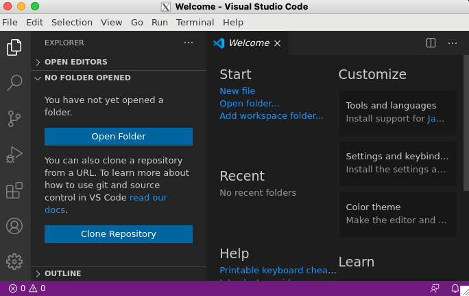

# Configuration Management Systems - ict4tn022-3010

Exercises in the course:  
[h1 hello master-slave](h1-hello-master-slave.md)  
[h2 package file-server](h2_package_file-server.md)  
[h3 version control](h3-versionhallinta.md)  
[h4 timeline](h4-timeline.md)  
[h5 new command](h5-new-command.md)  
[h6 moottorix](h6-moottorix.md)  
[h7 own module part 1](h7-my_module.md)  
[h7 own module part 2](h7-nagios.md)  

## h4 timeline

### Exercise a) 
Captain obvious. 

Linux distributions have a package management system, so installing programs is simple. Make a state that installs 10 of your favorite programs from package manager. In this step a, you can leave the programs at the default settings.


I deciced to install following programs: screen mutt tree links lftp curl ttyrec minicom irssi rtorrent

Test install manually in the slave:

`sudo apt install screen mutt tree links lftp curl ttyrec minicom irssi rtorrent -y`

After the install is succesfull, remove the packages with command:

`sudo apt remove screen mutt tree links lftp curl ttyrec minicom irssi rtorrent`

Install the packages with salt

Create the directory for the favorite programs:
`mkdir -p /srv/salt/favorites`

Create the salt state file:

`vi /srv/salt/favorites/init.sls`

```
install_favorite_programs:
  pkg.installed:
    - pkgs:
      - screen
      - mutt
      - tree
      - links
      - lftp
      - curl
      - ttyrec
      - minicom
      - irssi
      - rtorrent
```

Deploy the programs with command:

`sudo salt '*' state.apply favorites`

```
----------
          ID: install_favorite_programs
    Function: pkg.installed
      Result: True
     Comment: 10 targeted packages were installed/updated.
     Started: 19:33:57.473768
    Duration: 57039.142 ms
     Changes:
              ----------
              curl:
                  ----------
                  new:
                      7.58.0-2ubuntu3.10
                  old:
              imap-client:
                  ----------
                  new:
                      1
                  old:
              irssi:
                  ----------
                  new:
                      1.0.5-1ubuntu4.2
                  old:
              lftp:
                  ----------
                  new:
                      4.8.1-1ubuntu0.2
                  old:
              links:
                  ----------
                  new:
                      2.14-5build1
                  old:
              mail-reader:
                  ----------
                  new:
                      1
                  old:
              minicom:
                  ----------
                  new:
                      2.7.1-1
                  old:
              mutt:
                  ----------
                  new:
                      1.9.4-3ubuntu0.3
                  old:
              rtorrent:
                  ----------
                  new:
                      0.9.6-3build1
                  old:
              screen:
                  ----------
                  new:
                      4.6.2-1ubuntu1
                  old:
              tree:
                  ----------
                  new:
                      1.7.0-5
                  old:
              ttyrec:
                  ----------
                  new:
                      1.0.8-5build1
                  old:
              www-browser:
                  ----------
                  new:
                      1
                  old:

Summary for ict4n022-slave
------------
Succeeded: 1 (changed=1)
Failed:    0
------------
Total states run:     1
Total run time:  57.039 s
```

Update: 2020-11-26. 
Another option for installing multiple files would be using a text file containing all apps:

sudo vi /srv/salt/files/std-packages.txt

```
screen
mutt
tree
links
lftp
curl
ttyrec
minicom
irssi
rtorrent
```

and create same result with different init.sls file:
`sudo vi /srv/salt/favorites/init.sls`


```
# list of standard packages


install_standard_packages:
  pkg.latest:
    - pkgs: {{ std_packages }}

screenrc config:
  file.replace:
    - name: /etc/screenrc
    - pattern: '^#startup_message off'
    - repl: 'startup_message off'
    - show_changes: True
```

When we test applying the state, it provides equal result.

```
ict4n022-slave:
----------
          ID: install_standard_packages
    Function: pkg.latest
      Result: True
     Comment: All packages are up-to-date (curl, irssi, lftp, links, minicom, mutt, rtorrent, screen, tree, ttyrec).
     Started: 10:52:17.791401
    Duration: 18767.717 ms
     Changes:   
----------
          ID: screenrc config
    Function: file.replace
        Name: /etc/screenrc
      Result: True
     Comment: No changes needed to be made
     Started: 10:52:36.887964
    Duration: 78.749 ms
     Changes:   

Summary for ict4n022-slave
------------
Succeeded: 2
Failed:    0
------------
Total states run:     2
Total run time:  18.846 s
```


### Excercise b) 
Frog and scorpion. Add microsoft package repository and install Visual Studio Code.

slave:

Login to the slave using ssh:

`ssh slave`

First we'll install Microsoft keyring to /etc/apt/trusted.gpg.d/microsoft.gpg:

`wget -qO- https://packages.microsoft.com/keys/microsoft.asc | sudo apt-key --keyring /etc/apt/trusted.gpg.d/microsoft.gpg add -`

Next we'll add the repository under /etc/apt/sources.list.d directory (/etc/apt/sources.list.d/vscode.list):
`sudo sh -c 'echo "deb [arch=amd64 signed-by=/etc/apt/trusted.gpg.d/microsoft.gpg] https://packages.microsoft.com/repos/vscode stable main" > /etc/apt/sources.list.d/vscode.list'`

Next we'll update and download the package information from the sources with command:
`sudo apt-get update`

We can now install the Visual Studio Code with command:
`sudo apt install code`

The Visual Studio Code installs without errors.

As the slave is a server version of the Ubuntu LTS and as such I'm running any window manager requiring program remotely with XQuartz X.Org X Window System from my macOS laptop.


Let's try to start the visual studio with the command:
`code --disable-gpu`

I'm using the "--disable-gpu" parameter because the slave is a virtual server and does not have a real gpu.

The command returns following error:

`/usr/share/code/bin/../code: error while loading shared libraries: libX11-xcb.so.1: cannot open shared object file: No such file or directory`

As the slave is a server version, it doesn't have all the required libraries and apparently the Microsoft didn't include all the dependencies while packaging the Visual Studio Code application.

Let's try to find missing packages with command:
`sudo apt search libX11-xcb`

the search returns:

```
libx11-xcb1/bionic-updates,bionic-security 2:1.6.4-3ubuntu0.3 amd64
  Xlib/XCB interface library
```
Let's install the proposed package "libx11-xcb1" with command `sudo apt install libx11-xcb1` and try again:
`code --disable-gpu`

Apparently we are still missing something as the command returns errors again:

`/usr/share/code/bin/../code: error while loading shared libraries: libxcb-dri3.so.0: cannot open shared object file: No such file or directory`

Let's search the missing packages again:
`sudo apt search libxcb-dri3`

The search returns possible candidate:
```
libxcb-dri3-0/bionic-updates 1.13-2~ubuntu18.04 amd64
  X C Binding, dri3 extension
```
Let's install it with command `sudo apt install libxcb-dri3-0` and try again:
`code --disable-gpu`

Apparently we are still missing something as the command returns errors:
`/usr/share/code/bin/../code: error while loading shared libraries: libasound.so.2: cannot open shared object file: No such file or directory`

Let's search the missing packages once again:
`sudo apt search libasound`

The search returns yet another possible candidate: 

```
libasound2/bionic-updates 1.1.3-5ubuntu0.5 amd64
  shared library for ALSA applications
```

Let's install it with command `sudo apt install libasound2` which installs another dependent package `libasound2-data`

Let's try once more:
`code --disable-gpu`

The visual studio starts but returns blank/gray screen.


After googling a bit the issue, the search returns a [page](https://askubuntu.com/questions/1207883/x11-forwarding-google-chrome-and-chromium-browsers-grey-out-other-apps-show-ok) suggesting setting couple of qt x11 parameters to mitigate the issue:

```
export QT_X11_NO_MITSHM=1
export _X11_NO_MITSHM=1
export _MITSHM=0
```

I decided to test the parameters one by one:
`export QT_X11_NO_MITSHM=1` 

Let's try once more:
`code --disable-gpu`

After setting the variable `export QT_X11_NO_MITSHM=1` the visual studio is working:



So what was the problem?
The parameter in case was QT_X11_NO_MITSHM, which can be divided into following parts 

QT = open-source widget toolkit  
X11 = X Window System  
MITSHM = MIT Shared Memory Extension (MIT-SHM) 

So what we were doing was that we actually disabled using MIT Shared Memory Extension in the X Window System open-source widget toolkit for the remote sessions.

After being able to fully get everything working, we'll need to install the required libraries in addition to basic Visual Studio code 
The missing libraries were:
```
libx11-xcb1
libxcb-dri3-0
libasound2
```
The libasound2 installs the libasound2-data package and we dont' need to include it separately.

First we'll uninstall manually installed packages from the slave and remove the keys as well as added repositories:

```
sudo apt remove code libx11-xcb1 libxcb-dri3-0 libasound2 libasound2-data
sudo rm /etc/apt/trusted.gpg.d/microsoft.gpg*
sudo rm /etc/apt/sources.list.d/vscode.list
sudo apt update
```

Let's switch to the master and start creating the state file


sudo mkdir -p /srv/salt/vscode/files

We'll copy the Microsoft keyring (/etc/apt/trusted.gpg.d/microsoft.gpg) and repository file (/etc/apt/sources.list.d/vscode.list)from the slave to the /srv/salt/vscode/files directory:

and we'll create a code-remote.sh script for the visual studio code to be used while launching the app in remote sessions:

sudo vi /srv/salt/vscode/files/code-remote.sh

```
#!/bin/sh
export QT_X11_NO_MITSHM=1
/usr/bin/code --disable-gpu
```

let's create the state file:

sudo vi /srv/salt/vscode/init.sls
/etc/apt/trusted.gpg.d/microsoft.gpg:
  file.managed:
    - source: salt://vscode/files/microsoft.gpg

/etc/apt/sources.list.d/vscode.list:
  file.managed:
    - source: salt://vscode/files/vscode.list

install_required_libraries:
  pkg.installed:
    - pkgs:
      - libx11-xcb1
      - libxcb-dri3-0
      - libasound2
code:
  pkg.installed:
    - refresh: True

/usr/local/bin/code-remote.sh:
  file.managed:
    - source: salt://vscode/files/code-remote.sh
    - user: root
    - group: root
    - mode: 755 #set the executable permissions for the file

Let's test the deployment:

`sudo salt '*' state.apply vscode`

```
----------
          ID: code
    Function: pkg.installed
      Result: True
     Comment: The following packages were installed/updated: code
     Started: 22:57:01.076681
    Duration: 41071.362 ms
     Changes:   
              ----------
              code:
                  ----------
                  new:
                      1.51.1-1605051630
                  old:
              visual-studio-code:
                  ----------
                  new:
                      1
                  old:
----------
          ID: /usr/local/bin/code-remote.sh
    Function: file.managed
      Result: True
     Comment: File /usr/local/bin/code-remote.sh updated
     Started: 22:57:42.190914
    Duration: 174.619 ms
     Changes:   
              ----------
              diff:
                  New file
              mode:
                  0755

Summary for ict4n022-slave
------------
Succeeded: 5 (changed=5)
Failed:    0
------------
Total states run:     5
Total run time:  62.566 s
```

Let's test the deployment with the command `code-remote.sh`

The command returns working Visual Studio Code window:


### Exercise c) 
CSI Pasila. Create timeline from the files. Pick the example command and add %u to it:
`cd /etc/; sudo find -printf '%u %T+ %p\n'|sort|tail`

```
root 2020-11-24+21:14:50.8921057470 ./alternatives
root 2020-11-24+21:14:51.2841087490 ./X11/app-defaults
root 2020-11-24+22:56:36.1680032450 ./apt/trusted.gpg.d/microsoft.gpg
root 2020-11-24+22:56:36.1720032470 ./apt/trusted.gpg.d
root 2020-11-24+22:56:36.1960032610 ./apt/sources.list.d
root 2020-11-24+22:56:36.1960032610 ./apt/sources.list.d/vscode.list
root 2020-11-24+22:56:55.7880164990 ./ld.so.cache
root 2020-11-24+22:57:22.1800387450 ./mailcap
root 2020-11-25+00:22:48.7943880070 .
```

Let's break the command:  
the command `cd /etc;` changes to the /etc directory and the semicolon (;) operator allows to execute multiple commands in succession  
the command `sudo find ` search for files in a directory hierarchy (from the current path).  
the `-printf ` parameter with options prints the result using standard output format and `%u` prints file's user name  
the option `%T` outputs File's last modification time with  24-hour (hh:mm:ss.xxxxxxxxxx) format while the option `%p` prints the file's name. 

Run command that changes system's shared settings. 

Let's change the /etc/hosts file and add master's ip-address there
`sudo vi /etc/hosts`

`192.168.10.52 master`

check the changed files:

`cd /etc/; sudo find -printf '%u %T+ %p\n'|sort|tail`

We can see that the file hosts has been changed and the owner is root:

```
root 2020-11-24+21:14:50.8921057470 ./alternatives
root 2020-11-24+21:14:51.2841087490 ./X11/app-defaults
root 2020-11-24+22:56:36.1680032450 ./apt/trusted.gpg.d/microsoft.gpg
root 2020-11-24+22:56:36.1720032470 ./apt/trusted.gpg.d
root 2020-11-24+22:56:36.1960032610 ./apt/sources.list.d
root 2020-11-24+22:56:36.1960032610 ./apt/sources.list.d/vscode.list
root 2020-11-24+22:56:55.7880164990 ./ld.so.cache
root 2020-11-24+22:57:22.1800387450 ./mailcap
root 2020-11-25+00:23:24.1585443120 ./hosts
root 2020-11-25+00:23:24.1665443470 .
```
We can also see that only hosts file has been changed.

Let's create a salt state from the timeline command:

```
sudo mkdir /srv/salt/csi-pasila
sudo vi /srv/salt/csi-pasila/init.sls
```

```
#csi pasila
"cd /etc/; sudo find -printf '%u %T+ %p\n'|sort|tail":
  cmd.run
```

Continue with the timeline...

Let's change screenrc file to get rid of [Press Space or Return to end.] message while starting the screen.
First test the screen and notify that the banner appears. 
Create a copy of the screenrc 
sudo cp /etc/screenrc /etc/screenrc.bak

Find and uncomment the line: 
`#startup_message off`


`sudo vi /etc/screenrc`

Test that the banner screen disappears.

Now, let's create a state file for the change. As we already have the screen deployed in the favorites state file, let's add the configuration to the same file and apply the state again:

`sudo vi /srv/salt/favorites/init.sls `

```
screenrc config:
  file.replace:
    - name: /etc/screenrc
    - pattern: '^#startup_message off'
    - repl: 'startup_message off'
    - show_changes: True
```


let's apply the state:

```
----------
          ID: screenrc config
    Function: file.replace
        Name: /etc/screenrc
      Result: True
     Comment: Changes were made
     Started: 00:37:03.734295
    Duration: 10.463 ms
     Changes:   
              ----------
              diff:
                  --- 
                  +++ 
                  @@ -20,7 +20,7 @@
                   # SCREEN SETTINGS
                   # ------------------------------------------------------------------------------
                   
                  -#startup_message off
                  +startup_message off
                   #nethack on
                   
                   #defflow on # will force screen to process ^S/^Q

Summary for ict4n022-slave
------------
Succeeded: 2 (changed=1)
Failed:    0
------------
Total states run:     2
Total run time:   2.108 s
```
Now we can run the csi-pasila command with `sudo salt '*' state.apply csi-pasila`:


As we can see, the screenrc file has been changed and no other files changed.

```
ict4n022-slave:
----------
          ID: cd /etc/; sudo find -printf '%u %T+ %p
'|sort|tail
    Function: cmd.run
      Result: True
     Comment: Command "cd /etc/; sudo find -printf '%u %T+ %p
              '|sort|tail" run
     Started: 00:38:36.565735
    Duration: 491.04 ms
     Changes:   
              ----------
              pid:
                  25341
              retcode:
                  0
              stderr:
              stdout:
                  root 2020-11-24+22:56:36.1680032450 ./apt/trusted.gpg.d/microsoft.gpg
                  root 2020-11-24+22:56:36.1720032470 ./apt/trusted.gpg.d
                  root 2020-11-24+22:56:36.1960032610 ./apt/sources.list.d
                  root 2020-11-24+22:56:36.1960032610 ./apt/sources.list.d/vscode.list
                  root 2020-11-24+22:56:55.7880164990 ./ld.so.cache
                  root 2020-11-24+22:57:22.1800387450 ./mailcap
                  root 2020-11-25+00:23:24.1585443120 ./hosts
                  root 2020-11-25+00:36:50.4781529300 ./screenrc.bak
                  root 2020-11-25+00:37:03.7382040770 .
                  root 2020-11-25+00:37:03.7382040770 ./screenrc

Summary for ict4n022-slave
------------
Succeeded: 1 (changed=1)
Failed:    0
------------
Total states run:     1
Total run time: 491.040 ms
```

### Exercise d) 
Install some other program with settings.

Let's install ntp

slave:
manual installation phase

First we'll install ntpdate to test access for the time server and syncronizing time
`sudo apt install ntpdate`

`sudo ntpdate time.campus.hanu.org`

`25 Nov 00:58:12 ntpdate[14469]: adjust time server 192.168.10.7 offset -0.047348 sec`

Install the ntp daemon and configure it:
`sudo apt install ntp`

`sudo mv /etc/ntp.conf /etc/ntp.conf.bak`

`sudo vi /etc/ntp.conf`

```
# /etc/ntp.conf, configuration for ntpd; see ntp.conf(5) for help
driftfile /var/lib/ntp/ntp.drift

# Leap seconds definition provided by tzdata
leapfile /usr/share/zoneinfo/leap-seconds.list

statistics loopstats peerstats clockstats
filegen loopstats file loopstats type day enable
filegen peerstats file peerstats type day enable
filegen clockstats file clockstats type day enable

# Specify one or more NTP servers.
#
server time.campus.hanu.org iburst

# Use fi.pool.ntp.org servers as backup
pool 0.fi.pool.ntp.org iburst

# Local users may interrogate the ntp server more closely.
restrict 127.0.0.1
restrict ::1

# Needed for adding pool entries
restrict source notrap nomodify noquery
```

`sudo systemctl start ntp`

Test the status of the ntp service with `ntpq -p` command

```
     remote           refid      st t when poll reach   delay   offset  jitter
==============================================================================
*elwood.campus.h 62.237.86.238    2 u   45   64    3    0.800   -0.197   0.089
```

The system is working, so let's copy the ntp.conf into master and remove the ntp package and remove the ntp.conf files.
sudo apt remove ntp
sudo rm /etc/ntp.conf*

master:

`sudo mkdir -p /srv/salt/ntp/files`


`sudo vi /srv/salt/ntp/files/ntp.conf`

```
# /etc/ntp.conf, configuration for ntpd; see ntp.conf(5) for help
driftfile /var/lib/ntp/ntp.drift

# Leap seconds definition provided by tzdata
leapfile /usr/share/zoneinfo/leap-seconds.list

statistics loopstats peerstats clockstats
filegen loopstats file loopstats type day enable
filegen peerstats file peerstats type day enable
filegen clockstats file clockstats type day enable

# Specify one or more NTP servers.
#
server time.campus.hanu.org iburst

# Use fi.pool.ntp.org servers as backup
pool 0.fi.pool.ntp.org iburst

# Local users may interrogate the ntp server more closely.
restrict 127.0.0.1
restrict ::1

# Needed for adding pool entries
restrict source notrap nomodify noquery
```
Let's create the init file:  
`sudo vi /srv/salt/ntp/init.sls`

```
ntp:
  pkg.installed

/etc/ntp.conf:
  file.managed:
    - source: salt://ntp/files/ntp.conf
    - user: root
    - group: root
    - mode: 644
    - require:
      - pkg: ntp
    - watch_in:
      - service: ntp
```


Let's apply the state with the command `sudo salt '*' state.apply ntp`


```
ict4n022-slave:
----------
          ID: ntp
    Function: pkg.installed
      Result: True
     Comment: The following packages were installed/updated: ntp
     Started: 01:33:16.571077
    Duration: 20844.604 ms
     Changes:   
              ----------
              ntp:
                  ----------
                  new:
                      1:4.2.8p10+dfsg-5ubuntu7.3
                  old:
----------
          ID: /etc/ntp.conf
    Function: file.managed
      Result: True
     Comment: File /etc/ntp.conf updated
     Started: 01:33:37.511561
    Duration: 209.163 ms
     Changes:   
              ----------
              diff:
                  New file
              mode:
                  0644

Summary for ict4n022-slave
------------
Succeeded: 2 (changed=2)
Failed:    0
------------
Total states run:     2
Total run time:  21.054 s

```
Let's test the ntp status with the `ntpq -pn` command:

```
     remote           refid      st t when poll reach   delay   offset  jitter
==============================================================================
 0.fi.pool.ntp.o .POOL.          16 p    -   64    0    0.000    0.000   0.000
+2001:14ba:1ffe: 194.100.2.194    2 u   46   64    3    0.728    0.380   2.921
+95.216.154.135  193.11.166.8     2 u   48   64    3   11.451    2.516   3.946
*62.241.198.251  193.66.253.102   2 u   48   64    3   11.170    4.689   3.464
 95.216.142.52   194.58.205.20    2 u   40   64    1   11.606   11.745   0.620
```

The time service is working and seems to be defaulting IPv6 with the local server.
