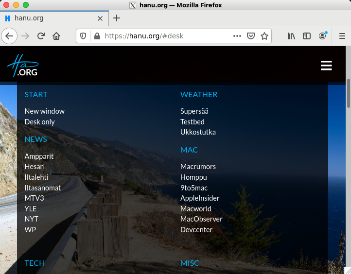

# Configuration Management Systems - ict4tn022-3010


Exercises in the course:  
[h1 hello master-slave](https://hanu.org/ict4tn022-3010/h1-hello-master-slave.html)  
[h2 package file-server](https://hanu.org/ict4tn022-3010/h2_package_file-server.html)  
[h3 version control](https://hanu.org/ict4tn022-3010/h3-versionhallinta.html)  
[h4 timeline](https://hanu.org/ict4tn022-3010/h4-timeline.html)  
[h5 new command](https://hanu.org/ict4tn022-3010/h5-new-command.html)  
[h6 moottorix](https://hanu.org/ict4tn022-3010/h6-moottorix.html)  
[h7 own module part 1](https://hanu.org/ict4tn022-3010/h7-my_module.html)  
[h7 own module part 2](https://hanu.org/ict4tn022-3010/h7-nagios.html)  

## h6 moottorix

### Excercise a) Install Nginx with Salt.

**Preface/Disclaimer:**

Some of the content of this exercise might be a bit hardcore at least for the beginners...

I typically tend to create scripts whenever there's a risk that I need to do things several times.
As this is once again an exercise, there's a probability that I'll have to do the same things multiple times...

The slave is a temporary server that I'm not going to use in "production", so there's no big risks involved in scripting.
And I'm perfectly capable of building the slave from the scratch again or do any deepdive restoring activities whenever needed...

However, I'm not recommending any of the shell/scripting content of this exercise to be used in production.  

So instead of editing the files manually each time, I'll do the basic changes with grep and sed and store the commands within a script file. 

**Slave:**

sudo apt install nginx -y

After the Nginx has been installed, we'll do some basic activities.

Check some Nginx default permissions which we are using in our state files:  
```
stat -c '%A %a %n' /etc/nginx/nginx.conf
-rw-r--r-- 644 /etc/nginx/nginx.conf
```

```
stat -c '%A %a %n' /etc/nginx/sites-available/default
-rw-r--r-- 644 /etc/nginx/sites-available/default
```


We could strip the content of the Nginx default config as a basis for our deployment with the command:  

`grep -vE '^\s*(#|$)' /etc/nginx/nginx.conf  >> nginx.default.conf`

But instead of stripping the help sections for the configuration, I'll just copy the nginx default config to a local directory:  
cp /etc/nginx/nginx.conf .

This gives us a small and

I'll start by creating a variable for the configuration file:  
`export slaveconf='/etc/nginx/sites-available/slave.campus.hanu.org.conf'`

Next I'll create a variable for the virtual server webroot:  

`export slavedir=/var/www/slave`

Copy the content of the Nginx default site as a basis for our virtual server:  
`grep -vE '^\s*(#|$)' /etc/nginx/sites-available/default |sudo tee $slaveconf`

```
server {
	listen 80 default_server;
	listen [::]:80 default_server;
	root /var/www/html;
	index index.html index.htm index.nginx-debian.html;
	server_name _;
	location / {
		try_files $uri $uri/ =404;
	}
}
```


Remove the default_server parameter from virtual server:  
`sudo sed -i 's/80 default_server/80/g' $slaveconf`

Change the server name to slave.campus.hanu.org:  
`sudo sed -i 's/server_name _/server_name slave.campus.hanu.org/g' $slaveconf`

Change the document root to /var/www/slave:  
`sudo sed -i 's/www\/html/www\/slave/g' $slaveconf`

Enable the virtual server by linking the block file to sites-enabled  
`sudo ln -s $slaveconf /etc/nginx/sites-enabled/`

Create the webroot for the virtual server slave:  
`sudo mkdir -p $slavedir`

Change the ownership for the current user to enable us to create some content:   
`sudo chown -R $USER:$USER $slavedir`

sudo chmod -R 755 /var/www/slave

So far we have had several commands from which we can create a simple script from history:

history |tail -10 | awk '{sub($1 FS,"")}7' >> do.it.again.sh

vi do.it.again.sh

```
#!/bin/sh
export slaveconf='/etc/nginx/sites-available/slave.campus.hanu.org.conf'
export slavedir='/var/www/slave/'
grep -vE '^\s*(#|$)' /etc/nginx/sites-available/default |sudo tee $slaveconf
sudo sed -i 's/80 default_server/80/g' $slaveconf
sudo sed -i 's/server_name _/server_name slave.campus.hanu.org/g' $slaveconf
sudo sed -i 's/www\/html/www\/slave/g' $slaveconf
sudo ln -s $slaveconf /etc/nginx/sites-enabled/
sudo mkdir -p $slavedir
sudo chown -R $USER:$USER $slavedir
```
So we'll have a basic script which creates a new virtual server configuration as well as the directories needed.

You can easily copy the script and change the patterns slave or slaveconf used within this exercise for something else.

You can use for example vi and sed for changing the patterns i.e.:

vi internal command for searching and replacing patterns after you have opened the file via vi:  
 `:1,$s/search-pattern/replace-pattern/g`  

If you want to have prompt for each change, you can enter c after /g like below:  
 `:1,$s/search-pattern/replace-pattern/gc`

sed command for searching and replacing patterns:  
`sed -i 's/old-text/new-text/g' filepath/filename`

After we have the script in place, we can create a index.html file:

Create a simple html page in the current directory (homedir):  
`vi index.html`

```
<!DOCTYPE html>
<html lang="en">
<head>
 <meta charset='utf-8'>
 <title>Hello</title>
<head>
<body>

<h1>Hello there</h1>
<p>Welcome to slave!</p>

</body>
</html>
```
Copy the index.html file into the /var/www/slave directory
`cp index.html $slavedir`

I could add the cp command also to the script and add some testing:  

```
#!/bin/sh
export slaveconf='/etc/nginx/sites-available/slave.campus.hanu.org.conf'
export slavedir='/var/www/slave/'
if [ ! -f "$slaveconf" ]
then
grep -vE '^\s*(#|$)' /etc/nginx/sites-available/default |sudo tee $slaveconf
sudo sed -i 's/80 default_server/80/g' $slaveconf
sudo sed -i 's/server_name _/server_name slave.campus.hanu.org/g' $slaveconf
sudo sed -i 's/www\/html/www\/slave/g' $slaveconf
else
        echo "$slaveconf already exists"
fi
if [ ! -d "$slavedir" ]
then
sudo mkdir -p $slavedir
sudo chown -R $USER:$USER $slavedir
cp $HOME/index.html $slavedir
else
        echo "$slavedir directory already exists"
fi
```


reload the ngix to test the virtual server:  
`sudo systemctl reload nginx`

`http slave.campus.hanu.org`

The server returns succesfully the content:  
```
HTTP/1.1 200 OK
Connection: keep-alive
Content-Encoding: gzip
Content-Type: text/html
Date: Tue, 08 Dec 2020 20:27:45 GMT
ETag: W/"5fcfe1bd-a4"
Last-Modified: Tue, 08 Dec 2020 20:27:41 GMT
Server: nginx/1.14.0 (Ubuntu)
Transfer-Encoding: chunked

<!DOCTYPE html>
<html lang="en">
<head>
 <meta charset='utf-8'>
 <title>Hello</title>
<head>
<body>

<h1>Hello there</h1>
<p>Welcome to slave!</p>

</body>
</html>
```

After testing manually, I'll copy the necessary files to the master and wipe nginx completely...

Let's switch to master:

Master:

Create the directory structure  
`sudo mkdir -p /srv/salt/nginx/files`

Let's create the init file:  
`sudoedit /srv/salt/nginx/init.sls`

```
# Install Nginx
nginx:
  pkg.installed

# check the service basic configs 
nginx service:
  service.running:
    - name: nginx
    - enable: True
    - reload: True
    - require:
      - pkg: nginx
    - watch:
      - file: /etc/nginx/nginx.conf
      - file: /etc/nginx/sites-available/default
      - file: /etc/nginx/sites-available/slave.campus.hanu.org.conf

# basic Nginx configuration
/etc/nginx/nginx.conf:
  file.managed:
    - source: salt://nginx/files/nginx.conf
    - user: root
    - group: root
    - mode: 644
    # Let's take a backup of the original
#    - backup: minion

# default site for the nginx
/etc/nginx/sites-available/default:
  file.managed:
    - source: salt://nginx/files/nginx.default
    - user: root
    - group: root
    - mode: 644
    # Let's take a backup of the original
    - backup: minion

# Create a new server block file for the virtual server to sites-available
/etc/nginx/sites-available/slave.campus.hanu.org.conf:
  file.managed:
    - source: salt://nginx/files/slave.campus.hanu.org.conf
    - user: root
    - group: root
    - mode: 644

# Enable the virtual server by linking the block file to sites-enabled
/etc/nginx/sites-enabled/slave.campus.hanu.org.conf:
  file.symlink:
    - target: /etc/nginx/sites-available/slave.campus.hanu.org.conf
    - require:
      - file: /etc/nginx/sites-available/slave.campus.hanu.org.conf

# Create directory for the virtual server content and assign permissions
/var/www/slave:
  file.directory:
    - user: hanu
    - group: hanu
    - mode: 755

# Create an index.html file for the virtual server
/var/www/slave/index.html:
  file.managed:
    - source: salt://nginx/files/index.slave.html
    # This is a webroot of the virtual server and 
    # I'm assigning content editing permissions for me
    # You'd assign corresponding values for your editors 
    - user: hanu
    - group: hanu
    # Change this to 664 when you need to allow editing to the group
    - mode: 644
    - watch_in:
      - service: nginx
```


Let's distribute the state:  
`sudo salt '*' state.apply nginx`

Operation succeeded:  

```
Summary for ict4n022-slave
------------
Succeeded: 8 (changed=8)
Failed:    0
------------
Total states run:     8
Total run time:  13.799 s
```

Test the site from the master:

`http slave.campus.hanu.org`

```
HTTP/1.1 200 OK
Connection: keep-alive
Content-Encoding: gzip
Content-Type: text/html
Date: Wed, 09 Dec 2020 01:06:08 GMT
ETag: W/"5fd0217d-a4"
Last-Modified: Wed, 09 Dec 2020 00:59:41 GMT
Server: nginx/1.14.0 (Ubuntu)
Transfer-Encoding: chunked

<!DOCTYPE html>
<html lang="en">
<head>
 <meta charset='utf-8'>
 <title>Hello</title>
<head>
<body>

<h1>Hello there</h1>
<p>Welcome to slave!</p>

</body>
</html>
```


Exercise b) Tee Nginx:n Saltilla jokin muukin asetus tai uusi ominaisuus.  

Let's change the index.html file to generate content based on the target system:  

`sudoedit /srv/salt/nginx/files/index.html.ninja`


```

<!DOCTYPE html>
<html lang="en">
<head>
 <meta charset='utf-8'>
 <title>Hello</title>
<head>
<body>
<h1>Hello there</h1>
<p>Welcome to:</p>

<h2>{{ serverHostname }}</h2>

</body>
</html>
```
Change the /var/www/slave/index.html section of the init.sls file:  

```
# Create an index.html file for the virtual server
/var/www/slave/index.html:
  file.managed:
    - source: salt://nginx/files/index.html.jinja
    - template: jinja
    # This is a webroot of the virtual server and 
    # I'm assigning content editing permissions for me
    # You'd assign corresponding values for your editors 
    - user: hanu
    - group: hanu
    # Change this to 664 when you need to allow editing to the group
    - mode: 644
    - watch_in:
      - service: nginx
```


`sudo salt '*' state.apply nginx`


```
    Duration: 1.195 ms
     Changes:   
----------
          ID: /var/www/slave/index.html
    Function: file.managed
      Result: True
     Comment: File /var/www/slave/index.html updated
     Started: 03:35:51.445234
    Duration: 27.598 ms
     Changes:   
              ----------
              diff:
                  --- 
                  +++ 
                  @@ -1,3 +1,4 @@
                  +
                   <!DOCTYPE html>
                   <html lang="en">
                   <head>
                  @@ -5,9 +6,10 @@
                    <title>Hello</title>
                   <head>
                   <body>
                  +<h1>Hello there</h1>
                  +<p>Welcome to:</p>
                   
                  -<h1>Hello there</h1>
                  -<p>Welcome to slave!</p>
                  +<h2>ict4n022-slave</h2>
                   
                   </body>
                   </html>

Summary for ict4n022-slave
------------
Succeeded: 8 (changed=1)
Failed:    0
------------
Total states run:     8
Total run time: 927.163 ms
```

Let's test the changes:  

`http slave.campus.hanu.org`


The index.html page is generated based on the hostname:    
```
HTTP/1.1 200 OK
Connection: keep-alive
Content-Encoding: gzip
Content-Type: text/html
Date: Wed, 09 Dec 2020 01:38:58 GMT
ETag: W/"5fd029f7-b7"
Last-Modified: Wed, 09 Dec 2020 01:35:51 GMT
Server: nginx/1.14.0 (Ubuntu)
Transfer-Encoding: chunked

<!DOCTYPE html>
<html lang="en">
<head>
 <meta charset='utf-8'>
 <title>Hello</title>
<head>
<body>
<h1>Hello there</h1>
<p>Welcome to:</p>

<h2>ict4n022-slave</h2>

</body>
</html>
```


c) Asenna jokin työpöytä- tai komentoriviohjelma asetuksineen Saltilla.

Slave:

Let's install Firefox with a command:  

`sudo apt install firefox -y`

and start it with `firefox` command from the shell.  
It opens up with the default homepage:    


Let's change the default homepage to our own:  
`sudoedit /etc/firefox/syspref.js`

```
// This file can be used to configure global preferences for Firefox
// Example: Homepage
//pref("browser.startup.homepage", "http://www.weebls-stuff.com/wab/");
pref("browser.startup.homepage", "https://hanu.org");
```
And test again.

This time Firefox opens up with customized homepage:  


Let's copy the sysprefs.js to master, do some cleanups and create a state file in the master:  

Master:  

sudo mkdir -p /srv/salt/firefox/files

sudoedit /srv/salt/firefox/init.sls


```
firefox:
  pkg.installed

/etc/firefox/syspref.js:
  file.managed:
    - source: salt://firefox/files/syspref.js
    - user: root
    - group: root
    - mode: 644
```

Distribute the app and configuration:  

`sudo salt '*' state.apply firefox`


```
     Changes:   
              ----------
              diff:
                  --- 
                  +++ 
                  @@ -1,4 +1,5 @@
                   // This file can be used to configure global preferences for Firefox
                   // Example: Homepage
                   //pref("browser.startup.homepage", "http://www.weebls-stuff.com/wab/");
                  +pref("browser.startup.homepage", "https://hanu.org");
                   

Summary for ict4n022-slave
------------
Succeeded: 2 (changed=2)
Failed:    0
------------
Total states run:     2
Total run time:  18.878 s
```

And let's fire it up and test the results: 

The exercise was succesful:


