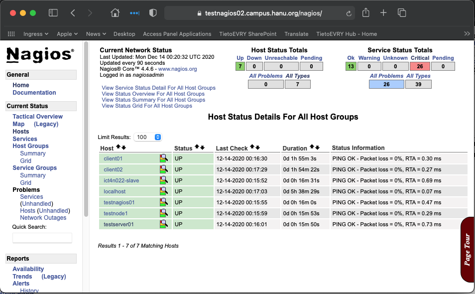
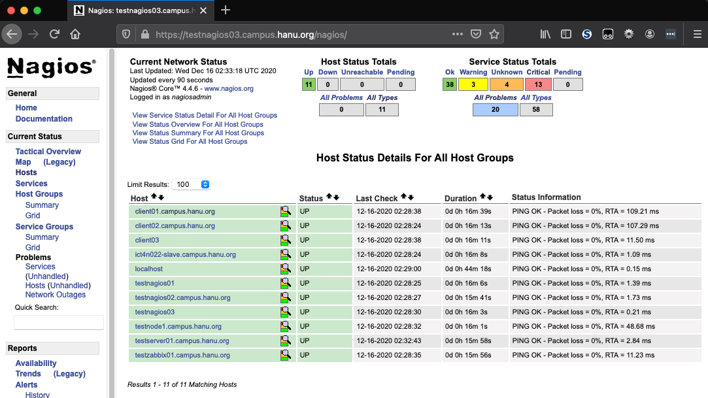

# Configuration Management Systems - ict4tn022-3010


Exercises in the course:  
[h1 hello master-slave](https://hanu.org/ict4tn022-3010/h1-hello-master-slave.html)  
[h2 package file-server](https://hanu.org/ict4tn022-3010/h2_package_file-server.html)  
[h3 version control](https://hanu.org/ict4tn022-3010/h3-versionhallinta.html)  
[h4 timeline](https://hanu.org/ict4tn022-3010/h4-timeline.html)  
[h5 new command](https://hanu.org/ict4tn022-3010/h5-new-command.html)  
[h6 moottorix](https://hanu.org/ict4tn022-3010/h6-moottorix.html)  
[h7 own module part 1](https://hanu.org/ict4tn022-3010/h7-my_module.html)  
[h7 own module part 2](https://hanu.org/ict4tn022-3010/h7-nagios.html)  


## h7 own module - part 2: Nagios monitoring system

This is the 2nd part of the final assignment: 

This time we'll test Nagios monitoring system.

The target for this part is to be able to install Nagios with Salt.

First we'll install Nagios manually...


### Server:

Log in to the Nagios server.

`sudo apt update`

#### Postfix

We'll install Postfix first to enable mail for the Nagios and Mutt as a client.

sudo apt install postfix mutt

We'll configure the Postfix as satellite system and having relay host as our local mail server.

I cleaned the "localhost.campus.hanu.org" from the /etc/postfix/main.cf file and moved the relayhost configuration to the last line:  

```
# See /usr/share/postfix/main.cf.dist for a commented, more complete version


# Debian specific:  Specifying a file name will cause the first
# line of that file to be used as the name.  The Debian default
# is /etc/mailname.
#myorigin = /etc/mailname

smtpd_banner = $myhostname ESMTP $mail_name (Ubuntu)
biff = no

# appending .domain is the MUA's job.
append_dot_mydomain = no

# Uncomment the next line to generate "delayed mail" warnings
#delay_warning_time = 4h

readme_directory = no

# See http://www.postfix.org/COMPATIBILITY_README.html -- default to 2 on
# fresh installs.
compatibility_level = 2

# TLS parameters
smtpd_tls_cert_file=/etc/ssl/certs/ssl-cert-snakeoil.pem
smtpd_tls_key_file=/etc/ssl/private/ssl-cert-snakeoil.key
smtpd_use_tls=yes
smtpd_tls_session_cache_database = btree:${data_directory}/smtpd_scache
smtp_tls_session_cache_database = btree:${data_directory}/smtp_scache

# See /usr/share/doc/postfix/TLS_README.gz in the postfix-doc package for
# information on enabling SSL in the smtp client.

smtpd_relay_restrictions = permit_mynetworks permit_sasl_authenticated defer_unauth_destination
myhostname = testnagios02.campus.hanu.org
alias_maps = hash:/etc/aliases
alias_database = hash:/etc/aliases
myorigin = /etc/mailname
mydestination = $myhostname, testnagios02.campus.hanu.org, localhost
mynetworks = 127.0.0.0/8 [::ffff:127.0.0.0]/104 [::1]/128
mailbox_size_limit = 0
recipient_delimiter = +
inet_interfaces = loopback-only
inet_protocols = all

relayhost = elwood.campus.hanu.org
```

I tested mail by sending email to myself.

#### Nagios

We can proceed with the Nagios.

Install the necessary packages:  
`sudo apt install -y autoconf bc gawk dc build-essential gcc libc6 make wget unzip apache2 php libapache2-mod-php7.2 libgd-dev libmcrypt-dev make libssl-dev snmp libnet-snmp-perl gettext`


I tend to store usually the sources into /usr/local/src directory:  
`cd /usr/local/src`

Download the latest Nagios core:  
`wget https://github.com/NagiosEnterprises/nagioscore/archive/nagios-4.4.6.tar.gz`

Let's extract the files  
`tar xzvf nagios-4.4.6.tar.gz`

and change to the Nagios source directory
`cd nagioscore-nagios-4.4.6/`

We'll configure the Nagios with apache (support). 
```
sudo ./configure --with-httpd-conf=/etc/apache2/sites-enabled
sudo make all
```

We'll create necessary users and groups and grant permission for www-data to access the nagios directories
```
sudo make install-groups-users
sudo usermod -a -G nagios www-data
```

We'll do the actual install of the software
```
sudo make install
sudo make install-daemoninit
sudo make install-init
sudo make install-commandmode
```

and install the configuration files (under /usr/local/nagios/etc)
`sudo make install-config`

```
sudo make install-webconf
sudo a2enmod rewrite cgi
```

We'll create htpasswd file with bcrypt encryption: 
`sudo htpasswd -c -B /usr/local/nagios/etc/htpasswd.users nagiosadmin`

And install nrpe-plugin that we are using for getting the info from the targets...
`sudo apt install nagios-plugins nagios-nrpe-plugin`

We'll prepare the monitoring targets by creating a directory for their configuration files.
```
cd /usr/local/nagios/etc
vi nagios.cfg
```

Uncomment cfg_dir=/usr/local/nagios/etc/servers

```
Create a new directory "/usr/local/nagios/etc/servers"
mkdir -p /usr/local/nagios/etc/servers
```

`cd /usr/local/nagios/etc/`

Change the default directory of the Nagios plugins as below:

$USER1$=/usr/lib/nagios/plugins

`vi resource.cfg`

Save and close

We'll change the Nagios contacts from root to our own contact info:

`vi objects/contacts.cfg`


Remember that if you change the contact_name, map the changed contact_name with the members in the contactgroup.

Save and close.

Add the check_nrpe to commands:

`vi objects/commands.cfg`

Paste following at the end of the file:

```
define command{
        command_name check_nrpe
        command_line $USER1$/check_nrpe -H $HOSTADDRESS$ -c $ARG1$
}
```

Restart and enable Nagios:

```
systemctl start nagios
systemctl enable nagios
```

Restart also apache:  

`systemctl restart apache2`


Test the Nagios with your browser:

http://servername/nagios

You'll get the login prompt and after you log in, you'll see the basic layout.


#### First client


log in to the client

```
sudo apt update
sudo apt install nagios-nrpe-server nagios-plugins
```

`cd /etc/nagios/`

`sudoedit nrpe.cfg`

define the client server ip-address as server_address.

```
# SERVER ADDRESS
# Address that nrpe should bind to in case there are more than one interface
# and you do not want nrpe to bind on all interfaces.
# NOTE: This option is ignored if NRPE is running under either inetd or xinetd

#server_address=127.0.0.1
server_address=192.168.13.79
```
Our client server address was 192.168.13.79

Add the nagios server ip-address to allowed_hosts

```
# ALLOWED HOST ADDRESSES
# This is an optional comma-delimited list of IP address or hostnames
# that are allowed to talk to the NRPE daemon. Network addresses with a bit mask
# (i.e. 192.168.1.0/24) are also supported. Hostname wildcards are not currently
# supported.
#
# Note: The daemon only does rudimentary checking of the client's IP
# address.  I would highly recommend adding entries in your /etc/hosts.allow
# file to allow only the specified host to connect to the port
# you are running this daemon on.
#
# NOTE: This option is ignored if NRPE is running under either inetd or xinetd

allowed_hosts=127.0.0.1,::1,192.168.13.76
```

Save and close

Edit the "nrpe_local.cfg" configuration with command `sudoedit nrpe_local.cfg` and add content below to it.
Change the client-ip-address with your client ip-address:


```
command[check_root]=/usr/lib/nagios/plugins/check_disk -w 20% -c 10% -p /
command[check_ping]=/usr/lib/nagios/plugins/check_ping -H client-ip-address -w 100.0,20% -c 500.0,60% -p 5
command[check_ssh]=/usr/lib/nagios/plugins/check_ssh -4 client-ip-address
command[check_http]=/usr/lib/nagios/plugins/check_http -I client-ip-address
command[check_apt]=/usr/lib/nagios/plugins/check_apt
```
In my case, the nrpe_local.cfg was:

```
command[check_root]=/usr/lib/nagios/plugins/check_disk -w 20% -c 10% -p /
command[check_ping]=/usr/lib/nagios/plugins/check_ping -H 192.168.13.79 -w 100.0,20% -c 500.0,60% -p 5
command[check_ssh]=/usr/lib/nagios/plugins/check_ssh -4 192.168.13.79
command[check_http]=/usr/lib/nagios/plugins/check_http -I 192.168.13.79
command[check_apt]=/usr/lib/nagios/plugins/check_apt
```

Now we can restart and enable the nagios-nrpe-server

```
systemctl restart nagios-nrpe-server
systemctl enable nagios-nrpe-server
```

Let's login back to the server and test the check_nrpe:

Basic test with just option for host (-H client-ip)
`/usr/lib/nagios/plugins/check_nrpe -H 192.168.13.79`
We'll get reply:  
`NRPE v3.2.1`  

Test check_ping with additional option `(-c check_ping) `    
`/usr/lib/nagios/plugins/check_nrpe -H 192.168.13.79 -c check_ping`  
We'll get reply:   
`PING OK - Packet loss = 0%, RTA = 0.09 ms|rta=0.087000ms;100.000000;500.000000;0.000000 pl=0%;20;60;0`  

We need to add the configuration of the new client into Nagios:
cd /usr/local/nagios/etc

Add a new configuration to the directory /usr/local/nagios/etc/servers
i.e. /usr/local/nagios/etc/servers/client-server-name.cfg

Our test client name was client01 and the ip-address 192.168.13.79, so we'll add those with command
sudo vi /usr/local/nagios/etc/servers/client01.cfg


```
# Ubuntu Host configuration file1

define host {
        use                          linux-server
        host_name                    client01
        alias                        Ubuntu Host
        address                      192.168.13.79
        register                     1
}

define service {
      host_name                       client01
      service_description             PING
      check_command                   check_nrpe!check_ping
      max_check_attempts              2
      check_interval                  2
      retry_interval                  2
      check_period                    24x7
      check_freshness                 1
      contact_groups                  admins
      notification_interval           2
      notification_period             24x7
      notifications_enabled           1
      register                        1
}

define service {
      host_name                       client01
      service_description             Check Users
      check_command                   check_nrpe!check_users
      max_check_attempts              2
      check_interval                  2
      retry_interval                  2
      check_period                    24x7
      check_freshness                 1
      contact_groups                  admins
      notification_interval           2
      notification_period             24x7
      notifications_enabled           1
      register                        1
}

define service {
      host_name                       client01
      service_description             Check SSH
      check_command                   check_nrpe!check_ssh
      max_check_attempts              2
      check_interval                  2
      retry_interval                  2
      check_period                    24x7
      check_freshness                 1
      contact_groups                  admins
      notification_interval           2
      notification_period             24x7
      notifications_enabled           1
      register                        1
}

define service {
      host_name                       client01
      service_description             Check Root / Disk
      check_command                   check_nrpe!check_root
      max_check_attempts              2
      check_interval                  2
      retry_interval                  2
      check_period                    24x7
      check_freshness                 1
      contact_groups                  admins
      notification_interval           2
      notification_period             24x7
      notifications_enabled           1
      register                        1
}

define service {
      host_name                       client01
      service_description             Check APT Update
      check_command                   check_nrpe!check_apt
      max_check_attempts              2
      check_interval                  2
      retry_interval                  2
      check_period                    24x7
      check_freshness                 1
      contact_groups                  admins
      notification_interval           2
      notification_period             24x7
      notifications_enabled           1
      register                        1
}

#define service {
#      host_name                       client01
#      service_description             Check HTTP
#      check_command                   check_nrpe!check_http
#      max_check_attempts              2
#      check_interval                  2
#      retry_interval                  2
#      check_period                    24x7
#      check_freshness                 1
#      contact_groups                  admins
#      notification_interval           2
#      notification_period             24x7
#      notifications_enabled           1
#      register                        1
#}
```

You can use the above content, if you change the host_name and the address accordingly.

After restarting the nagios, the client should be visible in the Nagios:

`sudo systemctl restart nagios`

Let's try to make all this to Salt and switch to Salt master:

#### Apache and snmpd

I had Apache and snmpd packages already completed during earlier exercises (h2 and h3) and I was using those when nagios needed Apache or snmpd package:  

[h2 package file-server](https://hanu.org/ict4tn022-3010/h2_package_file-server.html)  
[h3 version control](https://hanu.org/ict4tn022-3010/h3-versionhallinta.html)  

I installed apache with the command:  

`sudo salt 'testnagios02*' state.apply apache`

and snmp with the command:  

`sudo salt 'testnagios02*' state.apply snmp`

#### Postfix

Create a directory structure for the postfix.

sudo mkdir -p /srv/salt/postfix

sudoedit /srv/salt/postfix/init.sls

```
# install mutt
mutt:
  pkg:
    - installed

# install postfix have service watch main.cf
postfix:
  pkg:
    - installed
  service:
    - running
    - enable: True
    - watch:
      - pkg: postfix
      - file: /etc/postfix/main.cf

# postfix main configuration file
/etc/postfix/main.cf:
  file.managed:
    - source: salt://postfix/main.cf
    - user: root
    - group: root
    - mode: 644
    - template: jinja
    - require:
      - pkg: postfix

# manage /etc/aliases if data found in pillar

/etc/aliases:
  file.managed:
    - source: salt://postfix/aliases
    - user: root
    - group: root
    - mode: 644
    - template: jinja
    - require:
      - pkg: postfix

run-newaliases:
  cmd.wait:
    - name: newaliases
    - cwd: /
    - watch:
      - file: /etc/aliases


# manage /etc/aliases if data found in pillar

/etc/aliases:
  file.managed:
    - source: salt://postfix/aliases
    - user: root
    - group: root
    - mode: 644
    - template: jinja
    - require:
      - pkg: postfix

run-newaliases:
  cmd.wait:
    - name: newaliases
    - cwd: /
    - watch:
```

sudoedit /srv/salt/postfix/aliases

```
# Managed by salt
# See man 5 aliases for format
{{pillar['postfix']['aliases']}}
```

sudoedit /srv/salt/postfix/virtual

```
# Managed by salt
{{pillar['postfix']['virtual']}}
```

sudoedit /srv/salt/postfix/main.cf

```
# See /usr/share/postfix/main.cf.dist for a commented, more complete version

# Debian specific:  Specifying a file name will cause the first
# line of that file to be used as the name.  The Debian default
# is /etc/mailname.
#myorigin = /etc/mailname

smtpd_banner = $myhostname ESMTP $mail_name
biff = no

# appending .domain is the MUA's job.
append_dot_mydomain = no

# Uncomment the next line to generate "delayed mail" warnings
#delay_warning_time = 4h

readme_directory = no

# TLS parameters
smtpd_tls_cert_file=/etc/ssl/certs/ssl-cert-snakeoil.pem
smtpd_tls_key_file=/etc/ssl/private/ssl-cert-snakeoil.key
smtpd_use_tls=yes

smtpd_tls_session_cache_database = btree:${data_directory}/smtpd_scache
smtp_tls_session_cache_database = btree:${data_directory}/smtp_scache

# See /usr/share/doc/postfix/TLS_README.gz in the postfix-doc package for
# information on enabling SSL in the smtp client.

myhostname = {{ grains['fqdn'] }}
alias_maps = hash:/etc/aliases
alias_database = hash:/etc/aliases
mydestination = {{ grains['fqdn'] }}, localhost
mynetworks = 127.0.0.0/8 [::ffff:127.0.0.0]/104 [::1]/128
mailbox_size_limit = 0
recipient_delimiter = +
inet_interfaces = all

# relay through our relayhost
relayhost = [your-relay-host-name-here]:25



virtual_alias_maps = hash:/etc/postfix/virtual

```

I deployed Postfix with the command: 

`sudo salt 'testnagios02*' state.apply postfix`

After finishing with postfix, we'll move to Nagios


#### Nagios

Next we'll create a directory structure for Nagios:
sudo mkdir -p /srv/salt/nagios/files


And copy the configuration files into /srv/salt/nagios/files directory:


sudoedit vi /srv/salt/nagios/install.sls

```
# install the files required for compile
prepkgs:
  pkg.installed:
    - pkgs:
      - autoconf
      - bc
      - gawk
      - dc
      - build-essential
      - gcc
      - libc6
      - make
      - wget
      - unzip
      - php
      - libapache2-mod-php7.2
      - libgd-dev
      - libmcrypt-dev
      - libssl-dev
      - libnet-snmp-perl
      - gettext


install-foo:
  cmd.run:
    - name: |
        cd /usr/local/src
        wget https://github.com/NagiosEnterprises/nagioscore/archive/nagios-4.4.6.tar.gz
        tar xzf nagios-4.4.6.tar.gz
        cd nagioscore-nagios-4.4.6/
        ./configure --with-httpd-conf=/etc/apache2/sites-enabled
        make all
        make install-groups-users
        usermod -a -G nagios www-data
        make install
        make install-daemoninit
        make install-init
        make install-commandmode
        make install-config
        make install-webconf
        a2enmod rewrite cgi
        mkdir -p /usr/local/nagios/etc/servers

    - cwd: /tmp
    - shell: /bin/bash
    - timeout: 300
    - unless: test -x /usr/local/nagios/bin/nagios

/usr/local/nagios/etc/htpasswd.users:
  file.managed:
    - source: salt://nagios/files/htpasswd.users
    - user: root
    - group: root
    - mode: 644

nagios plugins:
  pkg.installed:
    - pkgs:
      - nagios-plugins
      - nagios-nrpe-plugin

/usr/local/nagios/etc/nagios.cfg:
  file.managed:
    - source: salt://nagios/files/nagios.cfg
    - user: nagios
    - group: nagios
    - mode: 0664

/usr/local/nagios/etc/resource.cfg:
  file.managed:
    - source: salt://nagios/files/resource.cfg
    - user: nagios
    - group: nagios
    - mode: 0660

/usr/local/nagios/etc/objects/contacts.cfg:
  file.managed:
    - source: salt://nagios/files/contacts.cfg
    - user: nagios
    - group: nagios
    - mode: 0664

/usr/local/nagios/etc/objects/commands.cfg:
  file.managed:
    - source: salt://nagios/files/commands.cfg
    - user: nagios
    - group: nagios
    - mode: 0664

nagios service:
  service.running:
    - name: nagios
    - enable: True
    - restart: True
    - watch:
      - file: /usr/local/nagios/etc/*

post-tasks:
 cmd.run:
   - name: |
       cd /tmp
       systemctl restart apache2

```


After applying the required components manually I created an init file which composes all required packages into single file:  

`sudoedit /srv/salt/nagios/init.sls`  

```
# include other components first
include:
  # Install snmp, postfix and apache first
  - snmp
  - postfix
  - apache
  # Then continue with the Nagios 
  - .install
```

#### Client configuration

I wanted include all test servers as monitoring targets.

`sudo salt '*' state.apply salt.client`

After pushing the Salt client to all minions, I tested copying the target files into salt server. 

Let's check how the Nagios is able to see the monitoring systems:



The Nagios server was able to see the servers, but I wanted to do that with salt too.

I have to admit that I had to spend a bit time and testing for enabling Salt to create all needed configuration files in a single state file and push that to the server.

I figured out that I could get list of all minions with command:  
`for agent in salt['mine.get']('*', 'grains.items' )`

Then I had to pass that to the jinja template.  

I found out that I can use `context` for that:  

```
 context:
      agent: {{ agent }}
```

Then I could use the agent variable and combine it to get ip-address of each agent.

```


```

I created config-servers.sls state file to deploy the agent config files to the server. 

```
include:
  - .install


  
/usr/local/nagios/etc/servers/{{ agent }}.cfg:
  file.managed:
    - source: salt://nagios/files/agent-nrpe.cfg
    - template: jinja
    - context:
      agent: {{ agent }}
#    - listen_in:
#      - service: nagios



restart nagios:
  service.running:
    - name: nagios
    - enable: True
    - restart: True
    - watch:
      - file: /usr/local/nagios/etc/servers/*
```

And then I copied the earlier target.cfg as a basis for our agent-nrpe.cfg file.

I changed it a bit: 

```


#  Monitored host configuration

define host {
        use                          linux-server
        host_name                    {{ agent }}
        alias                        Ubuntu Host
        address                      {{ addr }}
        register                     1
}

# Let's finalize the hostgroups later
# define hostgroup {
#    hostgroup_name          linux-servers
#    alias                   Linux Servers
#    members                 {{ agent }}             
#}

define service {
      host_name                       {{ agent }}
      service_description             PING
      check_command                   check_nrpe!check_ping
      max_check_attempts              2
      check_interval                  2
      retry_interval                  2
      check_period                    24x7
      check_freshness                 1
      contact_groups                  admins
      notification_interval           2
      notification_period             24x7
      notifications_enabled           1
      register                        1
}

define service {
      host_name                       {{ agent }}
      service_description             Check Users
      check_command                   check_nrpe!check_users
      max_check_attempts              2
      check_interval                  2
      retry_interval                  2
      check_period                    24x7
      check_freshness                 1
      contact_groups                  admins
      notification_interval           2
      notification_period             24x7
      notifications_enabled           1
      register                        1
}

define service {
      host_name                       {{ agent }}
      service_description             Check SSH
      check_command                   check_nrpe!check_ssh
      max_check_attempts              2
      check_interval                  2
      retry_interval                  2
      check_period                    24x7
      check_freshness                 1
      contact_groups                  admins
      notification_interval           2
      notification_period             24x7
      notifications_enabled           1
      register                        1
}

define service {
      host_name                       {{ agent }} 
      service_description             Check Root / Disk
      check_command                   check_nrpe!check_root
      max_check_attempts              2
      check_interval                  2
      retry_interval                  2
      check_period                    24x7
      check_freshness                 1
      contact_groups                  admins
      notification_interval           2
      notification_period             24x7
      notifications_enabled           1
      register                        1
}

define service {
      host_name                       {{ agent }}
      service_description             Check APT Update
      check_command                   check_nrpe!check_apt
      max_check_attempts              2
      check_interval                  2
      retry_interval                  2
      check_period                    24x7
      check_freshness                 1
      contact_groups                  admins
      notification_interval           2
      notification_period             24x7
      notifications_enabled           1
      register                        1
}
```

After completing the client part I included config-servers.sls into init.sls:  

```
# include other components first
include:
  # Install snmp, postfix and apache first
  - snmp
  - postfix
  - apache
  # Then continue with the Nagios 
  - .install
  - .config-servers
```

As the Nagios server part was finished, I created a state file for configuring the  clients.


`sudoedit /srv/salt/nagios/client.sls`

```
# Get hostname of the minion


refreshgrains:
  module.run:
    - name: saltutil.sync_grains

# Install required packages
  pkg.installed:
    - pkgs:
      - nagios-nrpe-server
      - nagios-plugins

/etc/nagios/nrpe.cfg:
  file.managed:
    - source: salt://nagios/files/nrpe.cfg
    - template: jinja
    - user: root
    - group: root
    - mode: 0644

restart nrpe:
  service.running:
  - name: nagios-nrpe-server
  - enable: True
  - restart: True
  - watch:
    - file: /etc/nagios/nrpe.cfg

/etc/nagios/nrpe_local.cfg:
  file.managed:
    - source: salt://nagios/files/nrpe_local.cfg
    - template: jinja
    - user: root
    - group: root
    - mode: 0644

/etc/nagios/{{ serverHostname }}-target.cfg:
  file.managed:
    - source: salt://nagios/files/target.cfg
    - template: jinja
    - user: root
    - group: root
    - mode: 0644
```

`sudoedit /srv/salt/nagios/files/nrpe.cfg`

```


log_facility=daemon
debug=0
pid_file=/var/run/nagios/nrpe.pid
server_port=5666
server_address={{ addr }}
nrpe_user=nagios
nrpe_group=nagios
# allowed_hosts=127.0.0.1,::1,192.168.13.96,192.168.13.76,192.168.13.98
allowed_hosts={{ pillar['nrpe_allowed_hosts'] }}
dont_blame_nrpe=0
allow_bash_command_substitution=0
command_timeout=60
connection_timeout=300

command[check_users]=/usr/lib/nagios/plugins/check_users -w 5 -c 10
command[check_load]=/usr/lib/nagios/plugins/check_load -r -w .15,.10,.05 -c .30,.25,.20
command[check_hda1]=/usr/lib/nagios/plugins/check_disk -w 20% -c 10% -p /dev/hda1
command[check_zombie_procs]=/usr/lib/nagios/plugins/check_procs -w 5 -c 10 -s Z
command[check_total_procs]=/usr/lib/nagios/plugins/check_procs -w 150 -c 200

include=/etc/nagios/nrpe_local.cfg
include_dir=/etc/nagios/nrpe.d/
```

`sudoedit /srv/salt/nagios/files/nrpe_local.cfg`

```


######################################
# Do any local nrpe configuration here
######################################
command[check_root]=/usr/lib/nagios/plugins/check_disk -w 20% -c 10% -p /
command[check_ping]=/usr/lib/nagios/plugins/check_ping -H {{ addr }} -w 100.0,20% -c 500.0,60% -p 5
command[check_ssh]=/usr/lib/nagios/plugins/check_ssh -4 {{ addr }}
command[check_http]=/usr/lib/nagios/plugins/check_http -I {{ addr }}
command[check_apt]=/usr/lib/nagios/plugins/check_apt
```

`sudoedit /srv/salt/nagios/files/target.cfg` 

```



#  Monitored host configuration

define host {
        use                          linux-server
        host_name                    {{ serverHostname }}
        alias                        Ubuntu Host
        address                      {{ addr }}
        register                     1
}

define service {
      host_name                       {{ serverHostname }}
      service_description             PING
      check_command                   check_nrpe!check_ping
      max_check_attempts              2
      check_interval                  2
      retry_interval                  2
      check_period                    24x7
      check_freshness                 1
      contact_groups                  admins
      notification_interval           2
      notification_period             24x7
      notifications_enabled           1
      register                        1
}

define service {
      host_name                       {{ serverHostname }}
      service_description             Check Users
      check_command                   check_nrpe!check_users
      max_check_attempts              2
      check_interval                  2
      retry_interval                  2
      check_period                    24x7
      check_freshness                 1
      contact_groups                  admins
      notification_interval           2
      notification_period             24x7
      notifications_enabled           1
      register                        1
}

define service {
      host_name                       {{ serverHostname }}
      service_description             Check SSH
      check_command                   check_nrpe!check_ssh
      max_check_attempts              2
      check_interval                  2
      retry_interval                  2
      check_period                    24x7
      check_freshness                 1
      contact_groups                  admins
      notification_interval           2
      notification_period             24x7
      notifications_enabled           1
      register                        1
}

define service {
      host_name                       client01
      service_description             Check Root / Disk
      check_command                   check_nrpe!check_root
      max_check_attempts              2
      check_interval                  2
      retry_interval                  2
      check_period                    24x7
      check_freshness                 1
      contact_groups                  admins
      notification_interval           2
      notification_period             24x7
      notifications_enabled           1
      register                        1
}

define service {
      host_name                       {{ serverHostname }}
      service_description             Check APT Update
      check_command                   check_nrpe!check_apt
      max_check_attempts              2
      check_interval                  2
      retry_interval                  2
      check_period                    24x7
      check_freshness                 1
      contact_groups                  admins
      notification_interval           2
      notification_period             24x7
      notifications_enabled           1
      register                        1
}
```

Then we can distribute the client configuration to minions:  

`sudo salt '*' state.apply nagios.client`

After finalizing with the client, the structure of the nagios folder is below:

```
├── client.sls
├── config-servers.sls
├── files
│   ├── agent-nrpe.cfg
│   ├── commands.cfg
│   ├── contacts.cfg
│   ├── htpasswd.users
│   ├── nagios.cfg
│   ├── nrpe-agent.cfg
│   ├── nrpe.cfg
│   ├── nrpe_local.cfg
│   ├── resource.cfg
│   └── target.cfg
├── init.sls
└── install.sls
```


After finalizing things, I created a new virtual server:   

`sudo salt-cloud -p testsalt-ubuntu testnagios03`

and applied a state:  

`sudo salt testnagios03 state.apply nagios`


Let's check from the browser:  



Looks good...  

The automation of monitoring system deployment could be increased more with salt's orchestrate function like presented in this site:  
[http://www.powelltechconsulting.com/salt-cloud-executing-an-auto-high-state/](http://www.powelltechconsulting.com/salt-cloud-executing-an-auto-high-state/)

The salt state files are stored also in github:  
[https://github.com/h4nu/salt-public](https://github.com/h4nu/salt-public)


